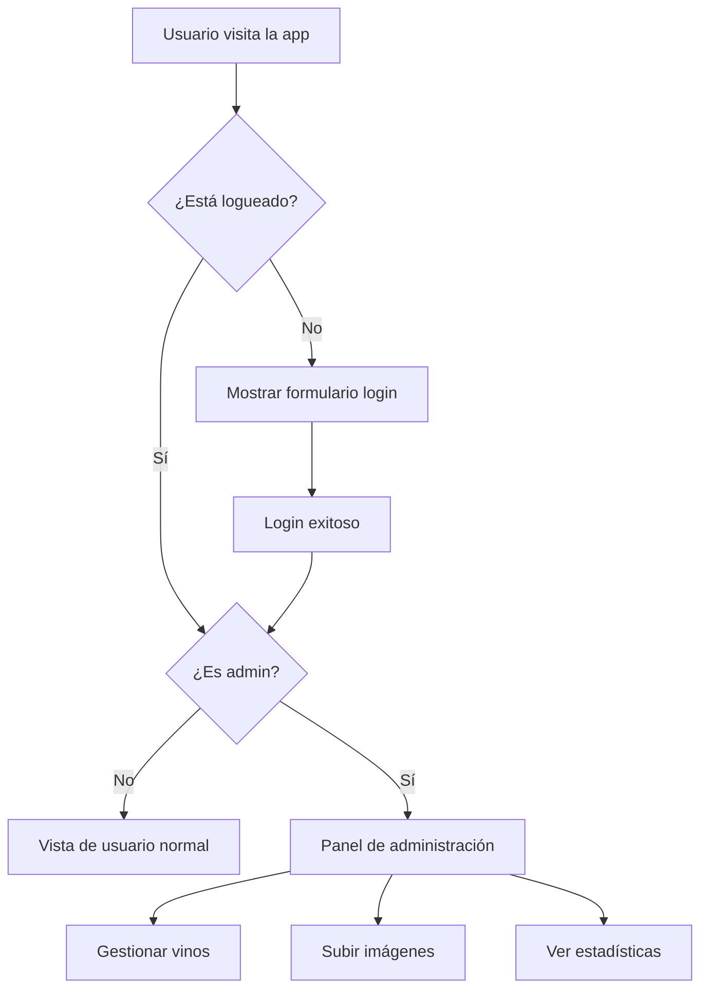

# 🔐 Guía: Configurar Firebase Authentication

## 🎯 Objetivo
Configurar sistema de autenticación completo para administradores de vinos de "La Pertenencia".

## 🚀 Configuración en Firebase Console

### 1. Habilitar Authentication

1. **Ve a Firebase Console**: https://console.firebase.google.com/project/lapertenencia25-8ff11
2. **Haz clic en "Authentication"** en el menú lateral
3. **Haz clic en "Get started"**

### 2. Configurar Métodos de Inicio de Sesión

#### A. Email/Password (Recomendado)
1. Ve a **"Sign-in method"**
2. Haz clic en **"Email/Password"**
3. **Habilita** la primera opción (Email/Password)
4. **Deshabilita** "Email link" (por ahora)
5. Haz clic en **"Save"**

#### B. Google Sign-in (Opcional pero recomendado)
1. Haz clic en **"Google"**
2. **Habilita** Google Sign-in
3. **Project public-facing name**: "La Pertenencia"
4. **Project support email**: tu email
5. Haz clic en **"Save"**
6. Prueb

### 3. Configurar Dominios Autorizados

1. Ve a **"Settings" > "Authorized domains"**
2. Por defecto están:
   - `localhost` (para desarrollo)
   - `lapertenencia25-8ff11.web.app` (para producción)
3. **Agrega tu dominio personalizado** cuando tengas uno

## 👥 Sistema de Roles de Administrador

### 4. Crear Usuario Administrador

#### Método 1: Desde Firebase Console
1. Ve a **"Users"** en Authentication
2. Haz clic en **"Add user"**
3. **Email**: tu email de admin (ej: `admin@lapertenencia.com`)
4. **Password**: contraseña segura
5. Haz clic en **"Add user"**
6. **¡IMPORTANTE!** Copia el **UID** del usuario creado

#### Método 2: Registro desde tu App
1. Usa el componente de registro que te voy a crear
2. Regístrate normalmente
3. Usa el script para obtener tu UID

## 🔧 Configuración de Administradores

### 5. Actualizar Reglas con tu UID

Después de crear tu usuario admin, necesitas actualizar las reglas:

#### En `firebase-rules/firestore.rules`:
```javascript
function isAdmin(userId) {
  return userId in [
    'TU_UID_REAL_AQUI',  // Reemplaza con el UID que copiaste
    // Agrega más UIDs de admins si necesitas
  ];
}
```

#### En `firebase-rules/storage.rules`:
```javascript
function isAdmin() {
  return request.auth.uid in [
    'TU_UID_REAL_AQUI',  // Reemplaza con el UID que copiaste
    // Agrega más UIDs de admins si necesitas
  ];
}
```

### 6. Republicar las Reglas

1. **Firestore Rules**: Ve a Firestore > Rules > Pega las reglas actualizadas > Publish
2. **Storage Rules**: Ve a Storage > Rules > Pega las reglas actualizadas > Publish

## 🧪 Probar Authentication

### 7. Componentes Listos para Usar

Ya tienes estos componentes creados:
- ✅ `hooks/useAuth.ts` - Hook de autenticación
- ✅ `components/examples/FirebaseExample.tsx` - Ejemplo completo
- ✅ Funciones de login, registro, Google Auth

### 8. Usar en tu App

```tsx
import { useAuth } from '@/hooks/useAuth';

function AdminPanel() {
  const { user, signIn, signOut, loading } = useAuth();

  if (loading) return <div>Cargando...</div>;

  if (!user) {
    return <LoginForm />;
  }

  return (
    <div>
      <h1>Panel de Administración de Vinos</h1>
      <p>Bienvenido, {user.displayName || user.email}</p>
      <button onClick={signOut}>Cerrar Sesión</button>
      {/* Aquí va tu panel de admin */}
    </div>
  );
}
```

## 🛡️ Seguridad Implementada

### Protecciones Automáticas:
- ✅ **Vinos**: Solo admins pueden crear/editar/eliminar
- ✅ **Imágenes**: Solo usuarios autenticados pueden subir
- ✅ **Datos de usuario**: Completamente privados
- ✅ **Validación de datos**: Automática en Firestore

### Funciones Disponibles:
- ✅ Login con email/password
- ✅ Login con Google
- ✅ Registro de nuevos usuarios
- ✅ Recuperación de contraseña
- ✅ Actualización de perfil
- ✅ Logout automático

## 📱 Flujo de Usuario Admin



## 🔍 Obtener tu UID de Admin

Para convertirte en admin, necesitas tu UID. Usa este código:

```tsx
import { useAuth } from '@/hooks/useAuth';

function GetMyUID() {
  const { user } = useAuth();
  
  if (!user) return <div>Debes estar logueado</div>;
  
  return (
    <div style={{ 
      background: '#f0f0f0', 
      padding: '20px', 
      fontFamily: 'monospace' 
    }}>
      <h3>Tu UID de Firebase:</h3>
      <code style={{ 
        background: '#333', 
        color: '#0f0', 
        padding: '10px',
        display: 'block'
      }}>
        {user.uid}
      </code>
      <p>📋 Copia este UID y úsalo en las reglas de Firebase</p>
    </div>
  );
}
```

## ✅ Checklist de Configuración

### En Firebase Console:
- [ ] Authentication habilitado
- [ ] Email/Password configurado
- [ ] Google Sign-in configurado (opcional)
- [ ] Usuario admin creado
- [ ] UID copiado

### En tu código:
- [ ] Reglas actualizadas con tu UID
- [ ] Reglas republicadas en Firestore
- [ ] Reglas republicadas en Storage
- [ ] Componente de login implementado

### Pruebas:
- [ ] Registro funciona
- [ ] Login funciona
- [ ] Google Auth funciona (si está habilitado)
- [ ] Admin puede gestionar vinos
- [ ] Usuarios normales no pueden editar

## 🚀 Próximos Pasos

Una vez configurado Authentication:
1. **Crear panel de administración** para gestionar vinos
2. **Implementar upload de imágenes** desde la app
3. **Crear sistema de pedidos** (opcional)
4. **Dashboard con estadísticas** (opcional)

## 🔗 Enlaces Útiles

- [Firebase Auth Documentation](https://firebase.google.com/docs/auth)
- [Authentication Console](https://console.firebase.google.com/project/lapertenencia25-8ff11/authentication)
- [Security Rules](https://firebase.google.com/docs/rules) 